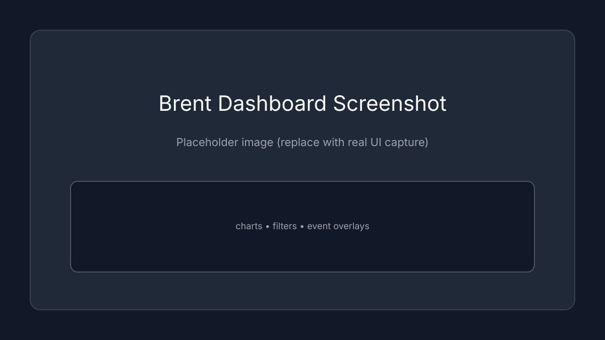

# Birhan Energies: Brent Oil Change Point Analysis

## Overview
This project analyzes structural breaks in Brent oil prices (1987–2022) using Bayesian Change Point detection (PyMC). It identifies key regimes associated with geopolitical events (conflicts, OLED policy, etc.) and presents the findings in an interactive dashboard.

## Project Structure
- `data/`: Raw and processed data (Brent prices, Event catalog).
- `docs/`: Analysis plans and assumptions.
- `notebooks/`: Jupyter notebooks for data engineering, EDA, and PyMC modeling.
- `backend/`: Flask API serving model results and data.
- `frontend/`: React + Vite dashboard for visualization.

## Setup & Installation

### 1. Environment
Ensure you have Python 3.10+ and Node.js 18+ installed.

### 2. Backend Setup
```bash
cd backend
pip install -r requirements.txt
python app.py
```
The API will run on `http://localhost:5000`.

### 3. Frontend Setup
```bash
cd frontend
npm install
npm run dev
```
The dashboard will run on `http://localhost:5173`.

### 4. Running the Analysis
To regenerate the model results (Task 2):
1. Open `notebooks/brent_changepoint.ipynb`.
2. Run all cells. 
   - This downloads fresh data from FRED.
   - Runs the MCMC sampler (PyMC).
   - Saves `data/analysis_results.json`.

## Methodology
- **Data Source**: FRED (DCOILBRENTEU), daily spot prices.
- **Model**: Bayesian Change Point model with a single switch point (Discrete Uniform prior for $\tau$).
- **Inference**: NUTS sampler via PyMC.
- **Diagnostics**: Stationarity checks (ADF/KPSS), summary stats, and posterior diagnostics (R-hat/ESS).

See the short model write-up in [docs/change_point_model.md](docs/change_point_model.md).

## Curated Event Catalog
The project includes a curated event table (15+ major events) in [data/events_catalog.csv](data/events_catalog.csv).
For a fixed, versioned snapshot used in review, see [data/events_catalog_v1.csv](data/events_catalog_v1.csv).

| Date | Event | Category | Hypothesized Impact |
| --- | --- | --- | --- |
| 1990-08-02 | Iraq invades Kuwait | Conflict | Immediate supply shock drives prices higher |
| 2014-11-27 | OPEC maintains production targets | Policy | Initiates price collapse into 2015 |
| 2022-02-24 | Russia invades Ukraine | Conflict | Sustained risk premium and volatility |

## Key Findings
(See dashboard for latest model run)
- The model detects structural breaks correlating with major supply shocks.
- Volatility clustering is observed during conflict periods (1990, 2011, 2022).

## Dashboard Filters
The UI includes explicit date-range and event-category filters:
- Start and end date inputs to focus the price timeline and event overlay.
- Event category dropdown (All, Conflict, Policy, Economic).
- Event markers toggle in the chart card.

## Screenshots


## API Endpoints

| Endpoint | Description | Notes |
| --- | --- | --- |
| `/api/health` | Health check | Returns backend status + data directory + results availability |
| `/api/analysis` | Latest analysis artifacts | Requires `data/analysis_results.json` |
| `/api/prices` | Price series (JSON) | Supports `limit`, `start`, `end` query params |
| `/api/events` | Event catalog | Reads `data/events_catalog.csv` |

### Example Queries
- `/api/prices?limit=1500`
- `/api/prices?start=2010-01-01&end=2012-12-31`

## Rubric Coverage Map

### Task 1: Foundation and Data Analysis Workflow (/5)
- Data acquisition, cleaning, and persistence: [notebooks/brent_changepoint.ipynb](notebooks/brent_changepoint.ipynb)
- EDA (trend, returns, volatility): [notebooks/brent_changepoint.ipynb](notebooks/brent_changepoint.ipynb)
- Data quality + stationarity diagnostics: [notebooks/brent_changepoint.ipynb](notebooks/brent_changepoint.ipynb)
- Assumptions and limitations: [docs/assumptions_limitations.md](docs/assumptions_limitations.md)
- Analysis plan & event research: [docs/task1_analysis_plan.md](docs/task1_analysis_plan.md)
- Change-point model summary: [docs/change_point_model.md](docs/change_point_model.md)

### Task 2: Bayesian Change Point Modeling (/8)
- PyMC model definition and sampling: [notebooks/brent_changepoint.ipynb](notebooks/brent_changepoint.ipynb)
- Posterior diagnostics and summaries: [notebooks/brent_changepoint.ipynb](notebooks/brent_changepoint.ipynb)
- Change point interpretation + event alignment: [notebooks/brent_changepoint.ipynb](notebooks/brent_changepoint.ipynb)
- Persisted artifacts for API use: [notebooks/brent_changepoint.ipynb](notebooks/brent_changepoint.ipynb)

### Task 3: Dashboard Development (/7)
- Flask API serving analysis + data: [backend/app.py](backend/app.py)
- React dashboard visualization: [frontend/src/App.jsx](frontend/src/App.jsx)
- UI styling: [frontend/src/index.css](frontend/src/index.css)
- Diagnostics & event-match panels: [frontend/src/App.jsx](frontend/src/App.jsx)

### Git & GitHub Best Practices (/4)
- Clear structure and documentation: [README.md](README.md)
- Ignored artifacts: [.gitignore](.gitignore)
- Consistent commit history and remote tracking (see Git log)

### Code Best Practices (/3)
- Modular functions and defensive checks: [backend/app.py](backend/app.py)
- UI state handling and error messaging: [frontend/src/App.jsx](frontend/src/App.jsx)
